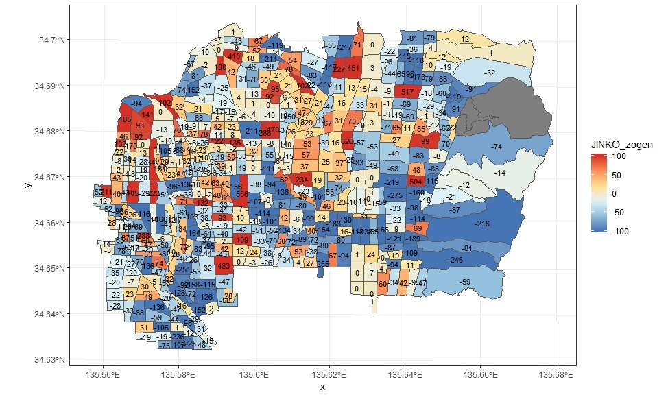

# kokuseichosa_jinko_setai_plot.R
H22とH27国勢調査による人口・世帯数の増減地図（町丁目）

サンプルは下記（東大阪市の人口増減）

## データの入手方法
e-stat(政府統計の総合窓口)から、「境界データダウンロード」「小地域」「国勢調査」「2015年」「小地域（町丁・字等別）」「世界測地系平面直角座標系・Shape形式」「大阪府」「大阪府全域」をダウンロードして「2015」フォルダに保存。
2010年のデータも同様にダウンロードして「2010」フォルダに保存。

#### ※shapeファイルに関する注意事項。 
他都道府県も同様にして地図作成可能ですが、大阪府では2010～2015年の間に市町村合併はないので、特に配慮はしていません。
国勢調査のshapeファイルは、町丁目や大字に基づいて小地域ごとに作成されていますが、一部では小字が使用されていたり、大字が複数に分割されています。
例えば、大阪府泉南郡岬町淡輪は10地区に区分されています。5年のうちに、住居表示が実施される等により、H22とH27に齟齬がある場合は灰色に表示されます。

#### ※ggplot2についての注意
sf パッケージとggplot2パッケージ(geom_sf)により、shapeファイルを描画しますが、ggplot2はver.3.0.0以降である必要があります（本件ではtidyverseパッケージによりggplot2をまとめて利用）。これはRがver3.5以降でないとインストールできない可能性があります(私のパソコンでは）。
ggplot2がver3.0.0以降でない場合は、devtoolsパッケージをインストールし、devtools::install_github("tidyverse/ggplot2") で開発版ggplot2をインストールする必要があります(ためしていせんが、以前は可能でした)。
ggplot2のver3.0.0は日本語が表示できますが、それ以前のgeom_sfは日本語が表示できませんので、このプログラムも日本語を地図に表示しないようにしています。

## 利用方法等
３部構成。前半はデータ読み込み・整理。中段は市区町村毎のPDF作成。後半は東大阪市を例に、１枚ずつの描画。
中段のPDFは、output.zipに保存してあるので、ダウンロード可能です。
